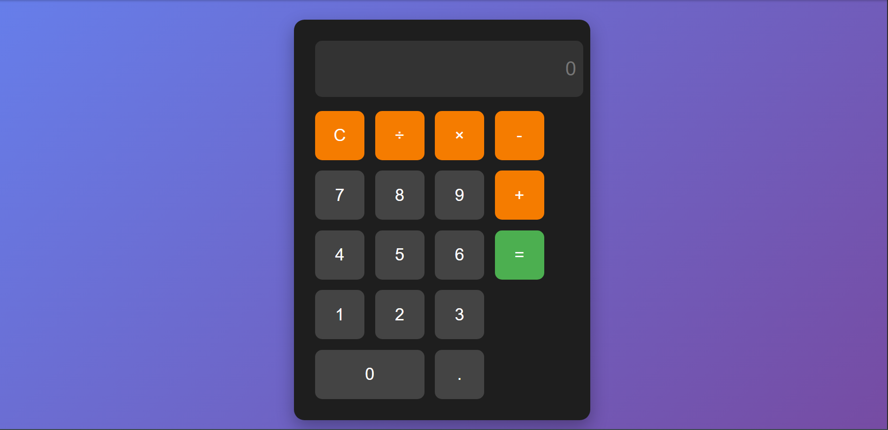

# Calculator App

A simple and responsive calculator application built using HTML, CSS and JavaScript.

## Live Demo
https://saadsiddiqui00.github.io/Calculator/

## Features

Basic arithmetic operations  
Clean and responsive UI  
Keyboard-style calculator layout

## Technologies Used
- HTML
- CSS
- JavaScript

- ## Screenshot

